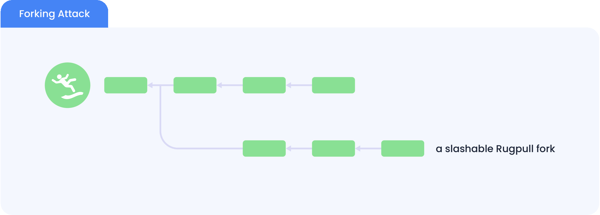
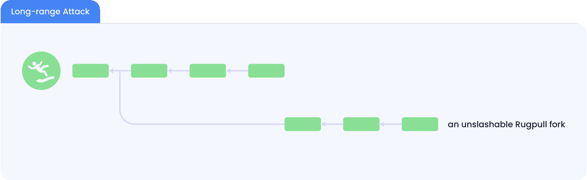
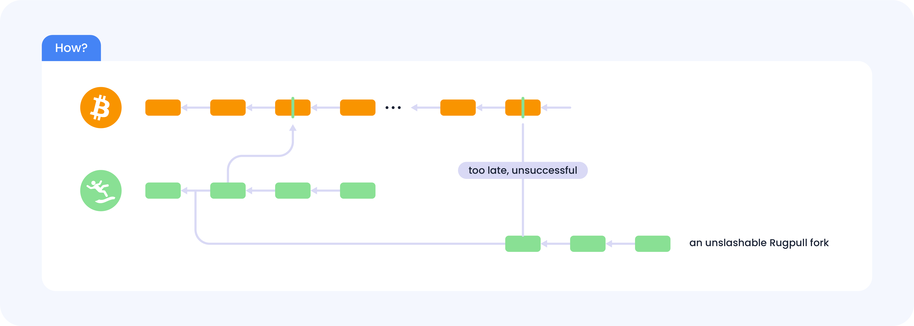

#  Primary Usecase: Securing PoS Chains
Learn about Babylon's use case for securing PoS chain transactions with Bitcoin timestamps.

---

## Long-Range Attack: A Fundamental Threat to PoS Chains 
By PoS chains, we refer to BFT (Byzantine-fault-tolerent) PoS chains that require a 2/3 majority vote from their validators to confirm a block. PoS chains are not supposed to fork, and when forking happens, the chain is attacked: To have 2/3 majority vote for both forks, at least 1/3 of the validators have double-voted by signing both forks, which is a prohibited behavior by the consensus protocol.

The picture below illustrates a forking attack to a hypothetical PoS chain called **“Rugpull“**.

To deter such attacks, most PoS chains only allow accounts who have bonded their tokens (a.k.a staking) to be validators. This way, if a validator is caught double signing, its bonded stake can be slashed by the consensus protocol in both forks, causing total economical loss to this malicious validator.

This deterrence seems to provide slashable security to PoS chains. However, this requires the remaining validators to perceive both forks while the malicious validators are still bonded. Therefore, to avoid slashing, the malicious validators can first unbond from the first fork and then create the second fork from a block height where they are still validators. This way, the malicious validators will not be slashable in the first fork since they do not have a bonded stake. What’s even worse is that once the attack happens, new users of the PoS chain cannot tell which fork they should follow.

This attack is called the long-range attack, which renders PoS chains not slashable and secure. This attack is fundamental and cannot be solved by modifying the consensus protocol without an extra source of trust. To alleviate this threat, some PoS chains resort to social consensus, where the stakeholders periodically make off-chain decisions on the correct block at the latest height and ignore any other potential forks. However, this approach ties the chain's security to the participating stakeholders' subjective opinions. This approach is also called weak subjectivity, which is against the decentralization principle. In addition, since social consensus takes time, most PoS chains impose a very long stake unbonding time in the order of weeks.

## Secure PoS using BTC timestamping 

To protect the PoS chain from long-range attacks, we can checkpoint the PoS chain blocks to BTC, and implement a fork choice rule for the fork with an earlier BTC timestamp. This way, either

- The attacking fork will have a later BTC timestamp in the BTC canonical chain and will never be chosen by anyone, or

- In order to be chosen, the attacker will have to create a very long fork of BTC in which the attacking PoS fork has an earlier timestamp, which is economically impossible.

Thus, long-range attacks are neutralized by BTC timestamping.

## 2.3 Benefits of BTC Timestamping to PoS Chains 
Along with solving long-range attacks, the irreversible BTC timestamps of PoS blocks also provide other security benefits to PoS chains:

- **No weak subjectivity**: Bitcoin timestamps are objective. It can thus eliminate the dependency of PoS chains on social consensus and weak subjectivity.

- **Shorter Unbonding Time**: By replacing social consensus, BTC timestamping can reduce the stake unbonding time of PoS chains from weeks to one day.

- **New Chain Bootstrapping**: New PoS chains with low valuation are more vulnerable to forking attacks. BTC timestamping can help safeguard the chain alone its growth.

- **Verification of State Sync and Snapshots**: The objective truth about a PoS chain provided by BTC allows the users of the PoS chain to verify the chain state or snapshot it has downloaded from the P2P network.

- **Protecting Important Transactions**: BTC timestamps can be used to further confirm important PoS transactions at the cost of longer confirmation latency.

- **Censorship Resistance**: BTC timestamping could also be used to fight against transaction censorship in PoS chains via posting censored transactions to BTC.

However, directly checkpointing to BTC is difficult and unscalable due to BTC’s tight space and expensive transaction fees. Moreover, BTC cannot verify the checkpointed data. This motivates the creation of Babylon, which solves all the difficulties with provable security.

:::info Note

Without **Babylon**, it is difficult for any chain to directly checkpoint to **Bitcoin** due to scalability, cost, code modification, and security problems.

:::
