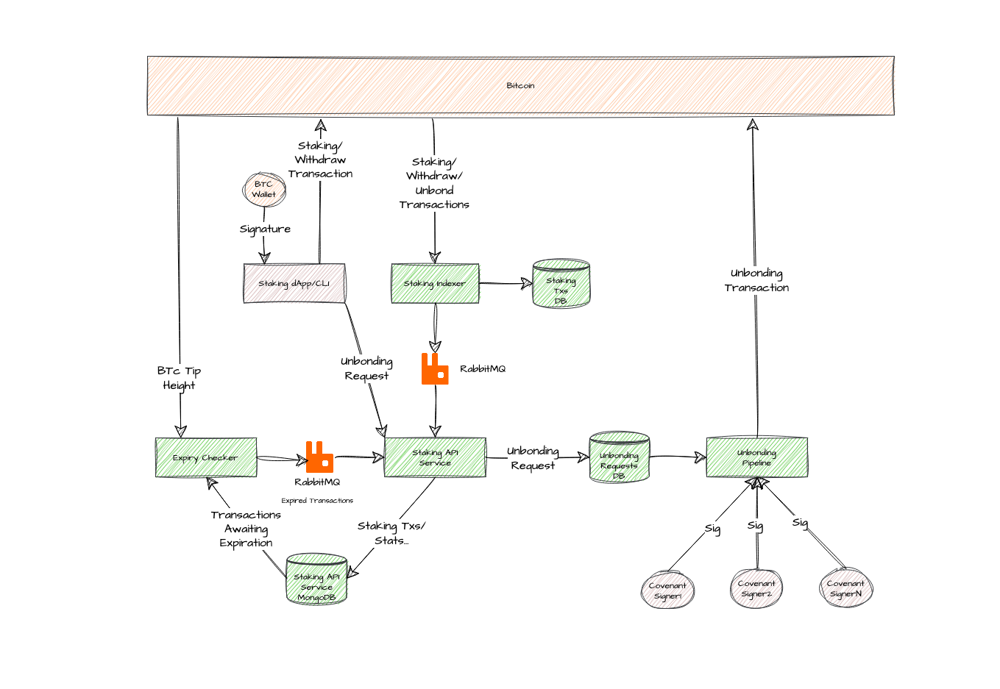

# Overview of Bitcoin Staking backend deployment

The Babylon Bitcoin Staking system comprises of the following components:

- [**BTC Staking Indexer**](../backend-deployment/services/staking-indexer.md):
Parses BTC blocks for valid staking, unbonding,
and withdrawal transactions, and forwards relevant events to a queueing system,
while also persisting them to an on-disk key-value storage.
- [**RabbitMQ**](./infra/rabbitmq.md):
Houses a set of queues containing BTC Staking transactions.
- [**Staking API Service**](./services/staking-api.md):
Consumes BTC Staking transactions from the RabbitMQ queues
and stores them in a central data store,
additionally accepting unbonding requests.
- [**MongoDB**](./infra/mongodb.md): Stores BTC Staking transaction data.
- [**Staking Expiry Checker**](./services/staking-expiry-checker.md):
Periodically checks MongoDB for expired BTC Stake Delegations and Unbondings.
- [**Unbonding Pipeline**](./services/staking-expiry-checker.md):
Forwards unbonding requests for signing to a Covenant Emulator committee
and submits them to the BTC network
- [**Staking Dashboard**](https://github.com/babylonchain/btc-staking-dashboard):
UI that allows for creating BTC Staking transactions.
Connects to the API to retrieve information about the system and historical delegations.
- [**Covenant Signer**](https://github.com/babylonchain/covenant-signer/blob/dev/docs/deployment.md#covenant-signer-setup-deployment):
Operated by members of the covenant committee.
Receives unbonding transactions and returns the same
transactions signed by the covenant emulator's key.
- [**Bitcoin Full Node**](./infra/bitcoind.md):
Verify whether the staking transaction has already been
submitted to Bitcoin network
and has the required amount of BTC confirmations.
- [**Bitcoin Offline Wallet**](https://github.com/babylonchain/covenant-signer/blob/dev/docs/deployment.md#3-bitcoind-offline-wallet-operations):
Stores the Covenant Signer member keys
and signs unbonding transactions forwarded by the Covenant Signer.
- [**A Global Configuration file**](./global-system-configuration.md)
that contains system-wide parameters pertinent
to the processed Staking transactions.
- [**A Finality Provider config file**](./global-system-configuration.md)
that associates finality provider
BTC public keys with additional information about them such
as their moniker, commission etc.
