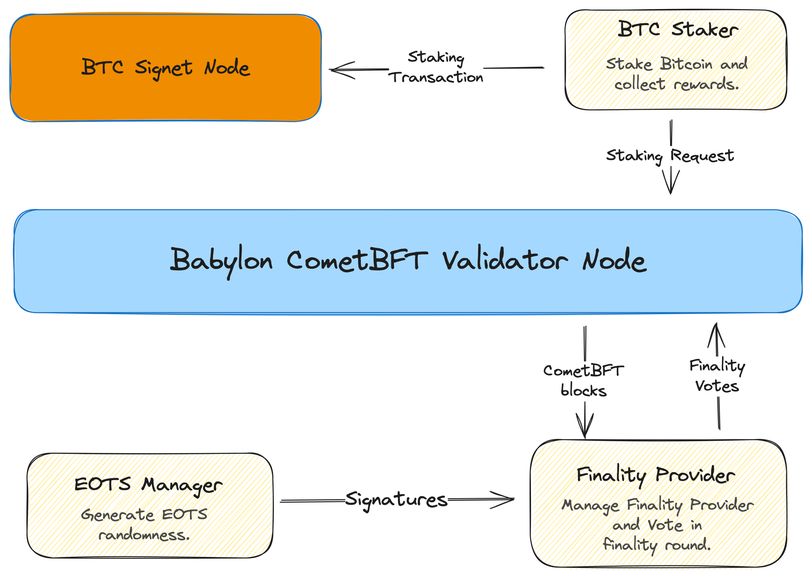

# Overview of Validator Deployment

In this testnet, Babylon's Bitcoin staking protocol secures the Babylon blockchain
via an extra round of voting on top of the CometBFT consensus, called the
*finality round*. This round is conducted by *finality providers*, which are the
"validators" that accept Bitcoin as stake delegations. Finality providers use
their EOTS keys to cast finality votes on Babylon blocks generated by CometBFT.
A Babylon block that has received more than 2/3 finality votes from the active
finality provider set is BTC-finalized.

Therefore, one can join BTC staking testnet via one (or more) of the three sets
of actions:

1. Become a *Babylon CometBFT validator* and accept Babylon
   test token delegations. For this, you need to
   [deploy and maintain a Babylon node](../installation.md) and
   [register a CometBFT validator](./become-validator.md).
2. Become a *finality provider* and accept signet BTC delegations.
   For this, you need to use the [finality provider
   program](./finality-providers/overview.md).
   This serves as the control plane for finality providers. It allows
   creating, managing, and operating finality providers on the Babylon ledger.
   Its functionality is split into two daemons:
   - the EOTS manager daemon, which serves as a server for securely managing
     the EOTS keys of the finality provider and generating signatures using them;
     and
   - the finality provider daemon, which is responsible for maintaining a
     connection with a Babylon node and submitting finality votes for new
     blocks after they are generated by CometBFT.
3. *Self-Delegate* BTC to your finality provider in a trustless way to gain
   voting power. You can accomplish this by operating the [BTC Staker program](
   ./become-btc-staker). The most secure setup involves
   a connection to a self-hosted Bitcoin node to submit and monitor the
   confirmation state of staking transactions and
   a connection to a Babylon node to submit staking requests.
   For this testnet, we are utilising the BTC signet network to enable for
   harmless experimentation. Syncing a node to the BTC signet is super fast and
   should not take more than 60 minutes. After performing a self-delegation
   to your finality provider you can shut down the Bitcoin node and the
   btc-staker if you do not intend to make any further delegations.
   Alternatively, you could self-delegate BTC Signet tokens via the staking web
   application when it becomes available.

CometBFT validators and Finality providers are independent entities - you can be
any of the 2. To fully participate in the testnet, we
strongly encourage experimenting with both and executing self-delegations.
