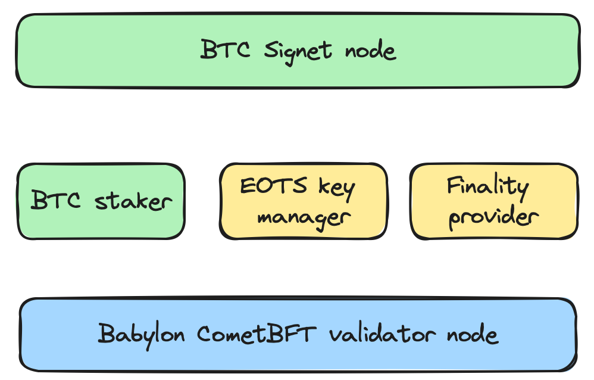

# Overview of Validator Deployment

In this testnet, Babylon Bitcoin staking protocol secures the Babylon blockchain
via an extra round of voting on top of the CometBFT consensus, called the
*finality round*. This round is conducted by *finality providers*, which are the
"validators" that accepts bitcoins as stake delegations. Finality providers use
their EOTS keys to cast finality votes on Babylon blocks generated by CometBFT.
A Babylon block that has received more than 2/3 finality votes from the active
finality provider set is BTC-finalized.

Therefore, one can join BTC staking testnet via one (or more) of the three sets
of actions:

1. become a *Babylon CometBFT validator* and accept delegations of Babylon test
   token. For this, you need to deploy and maintain a Babylon node daemon.
2. become a *finality provider* and accept delegations of bitcoins on Bitcoin
   Signet. For this, you need to deploy and maintain
   - an EOTS manager daemon, which manages your EOTS keys; and
   - a finality provider, which connects to a Babylon node you trust and casts
    finality votes.
3. To *self-delegate* bitcoins in a trustless way, you can run a BTC Signet node
and a BTC staker program. After submitting delegation request to Babylon, these
programs can be shut down and you don't need to keep them up. Alternatively, you
could self-delegate BTC Signet tokens via the staking web application provided
by the Babylon team.

CometBFT validators and Finality providers are independent entities - you can be
any of the 2. To fully participate in the testnet, we
strongly encourage experimenting with both and executing self-delegations.
