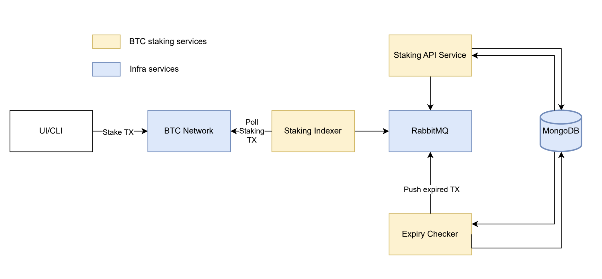

# Overview of Phase-1 deployment

The Babylon's Phase-1 system comprises the following components:
- BTC Staking Indexer: Parses BTC blocks and forwards BTC Staking transactions to a queueing system, while also persisting them to an on-disk key-value storage
- RabbitMQ: Houses a set of queues containing BTC Staking transactions
- Staking API Service: Consumes BTC Staking transactions from the RabbitMQ queues and stores them in a central data store, additionally accepting unbonding requests
- MongoDB: Stores BTC Staking transaction data
- Staking Expiry Checker: Periodically checks MongoDB for expired BTC Stake Delegations and Unbondings
- A Global Configuration file that contains system-wide parameters pertinent to the processed Staking transactions
- A Finality Provider config file that contains information about finality providers participating in the system